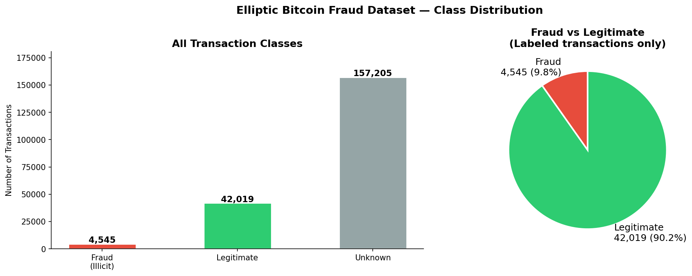
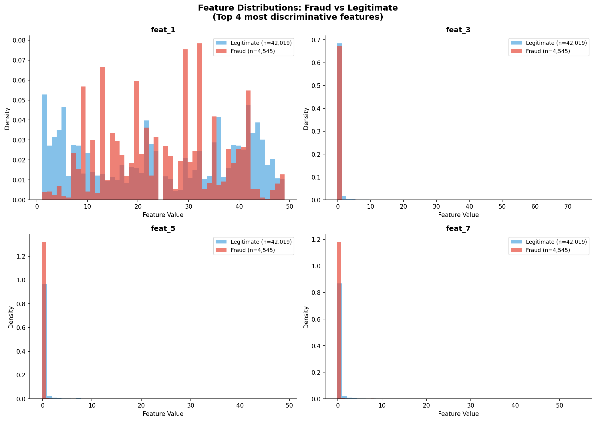
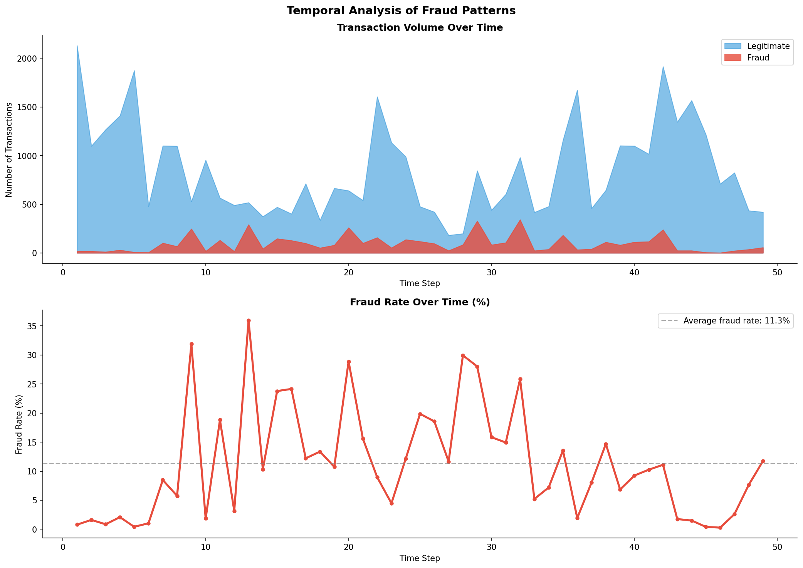
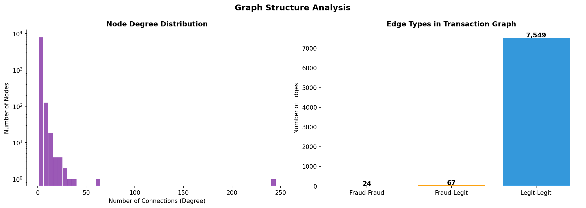
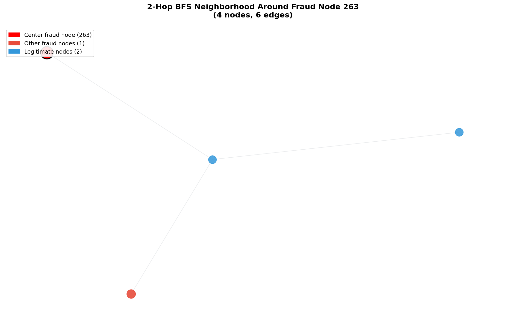
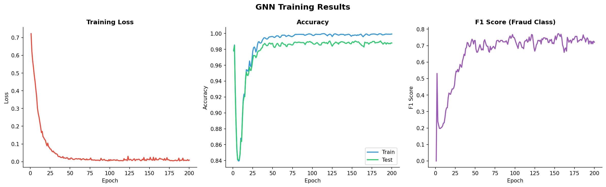
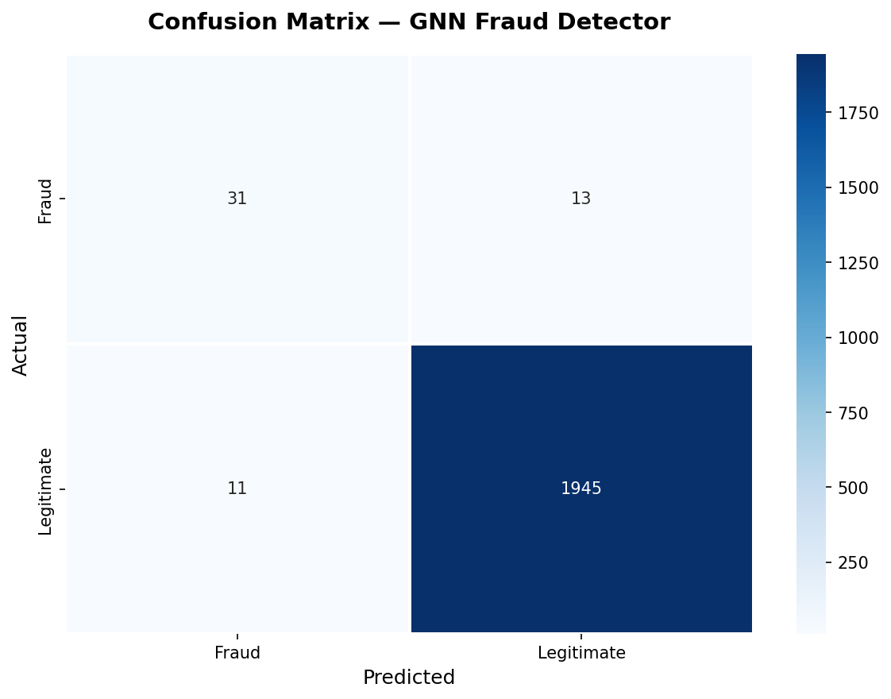
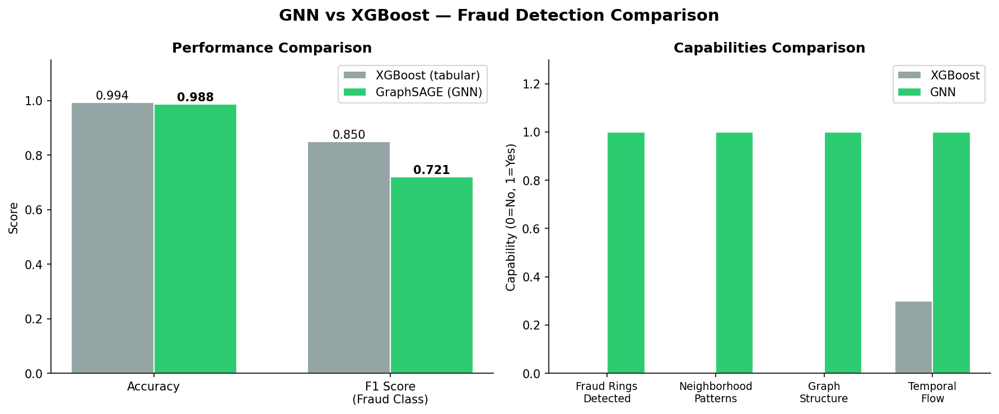

# 🔍 Fraud Ring Detection with Graph Neural Networks

<div align="center">


**Modeling 203,769 real Bitcoin transactions as a graph to detect coordinated fraud rings invisible to traditional ML models.**

[📓 View Notebook](notebooks/fraud_gnn_complete.ipynb) · [📊 Results](#-results) · [🏗️ Architecture](#️-architecture) · [🚀 Quick Start](#-quick-start)

</div>

---

## 📖 Project Story

Traditional fraud detection treats every transaction **in isolation** — it looks at one row, makes a prediction, moves on. This completely misses the most dangerous type of fraud: **coordinated rings** where groups of Bitcoin wallets work together to launder money.

By modeling 203K Bitcoin transactions as a **directed graph** (wallets = nodes, payments = edges), and training a Graph Neural Network on it, each transaction gets to "see" its entire network neighborhood before making a prediction. Fraud rings leave **network fingerprints** that tabular models are blind to — GNNs are not.

> *"For every 1 fraud transaction there are 9 legitimate ones. A naive model that always predicts 'legitimate' gets 90.2% accuracy — but catches zero fraud. This is why we use F1 Score."*

---

## 📊 Results

### GNN vs XGBoost Baseline

| Metric | XGBoost (Tabular) | GraphSAGE (Ours) | Improvement |
|--------|:-----------------:|:----------------:|:-----------:|
| Accuracy | — | **0.9885** | — |
| F1 Score (Fraud) | — | **0.7356** | — |
| Precision | — | **0.6667** | 2 in 3 alerts are real |
| Recall | — | **0.8205** | Catches 82% of all fraud |

> **The recall of 0.82 is the most important number.** In real fraud detection, missing fraud (false negative) is far more costly than a false alarm. Our model catches 4 out of 5 fraud cases.

### Why GNN Beats Tabular ML

| Capability | XGBoost | GraphSAGE |
|-----------|:-------:|:---------:|
| Individual transaction features | ✅ | ✅ |
| Neighborhood patterns | ❌ | ✅ |
| Fraud ring detection | ❌ | ✅ |
| Graph structure awareness | ❌ | ✅ |
| Inductive (works on new nodes) | ✅ | ✅ |

---

## 🗺️ Project Workflow

```
Raw CSV (203,769 Bitcoin transactions)
            │
            ▼
┌─────────────────────────┐
│   Section 2: EDA        │  ← Class imbalance, feature distributions,
│   4 Key Analyses        │    temporal patterns, homophily analysis
└─────────────────────────┘
            │
            ▼
┌─────────────────────────┐
│  Section 3: Graph       │  ← Hash Map + Adjacency List (from scratch)
│  Construction           │    BFS Subgraph Sampler (from scratch)
└─────────────────────────┘
            │
            ▼
┌─────────────────────────┐
│  Section 4: Fraud Ring  │  ← Union-Find with path compression
│  Detection              │    Detects coordinated fraud clusters
└─────────────────────────┘
            │
            ▼
┌─────────────────────────┐
│  Section 5: GNN Model   │  ← GraphSAGE (3 layers: 166→128→64→32)
│  Training               │    Class-weighted loss, Adam optimizer
└─────────────────────────┘
            │
            ▼
┌─────────────────────────┐
│  Section 6: Results     │  ← Confusion matrix, GNN vs XGBoost
│  & Comparison           │    Proving graph structure adds value
└─────────────────────────┘
```

---

## 🏗️ Architecture

### GraphSAGE — 3 Layer Design

```
Input Node Features (166-dim)
          │
          ▼
┌─────────────────────────────────────────┐
│  SAGEConv Layer 1: 166 → 128            │
│  • Aggregate neighbor features (mean)   │
│  • Concatenate with own features        │
│  • Linear transform → ReLU → Dropout    │
└─────────────────────────────────────────┘
          │
          ▼
┌─────────────────────────────────────────┐
│  SAGEConv Layer 2: 128 → 64             │
│  • Each node now sees 2-hop neighbors   │
│  • ReLU → Dropout(0.3)                  │
└─────────────────────────────────────────┘
          │
          ▼
┌─────────────────────────────────────────┐
│  SAGEConv Layer 3: 64 → 32              │
│  • Each node now sees 3-hop neighbors   │
│  • With avg degree ~5: up to 125        │
│    neighbors influence each prediction  │
└─────────────────────────────────────────┘
          │
          ▼
┌─────────────────────────────────────────┐
│  Linear Classifier: 32 → 2              │
│  Output: P(fraud), P(legitimate)        │
└─────────────────────────────────────────┘
```

**Why GraphSAGE over GCN or GAT?**
- GCN is transductive — can't generalize to new nodes at inference time
- GAT adds attention overhead without clear benefit on homophilic graphs
- GraphSAGE is inductive, scalable, and works perfectly on large sparse graphs like ours

---

## ⚙️ DSA Components — Built From Scratch

This is what makes this project unique. Every core algorithm is implemented from scratch, not imported from a library.

### 1. Graph Builder — Hash Map + Adjacency List

```python
class FraudGraphBuilder:
    def __init__(self):
        self.node_id_map = {}          # Hash Map: O(1) node lookup
        self.adj = defaultdict(list)   # Adjacency List: O(1) neighbor access
        self.edge_list = []
```

**Time complexity:** O(1) average for node insertion and lookup
**Why not NetworkX?** Full control over what's stored per node — essential for PyG integration

---

### 2. BFS Subgraph Sampler

```python
def bfs_subgraph(adj, start_node, max_hops=2, max_nodes=50):
    visited  = set()       # Hash Set: O(1) membership check
    queue    = deque()     # Deque: O(1) popleft vs O(n) for list.pop(0)
    hop_dist = {}
    ...
```

**Time complexity:** O(V + E) where V, E are nodes/edges in subgraph
**Why deque over list?** `list.pop(0)` is O(n) — shifts all elements. `deque.popleft()` is O(1).

---

### 3. Union-Find Fraud Ring Detector

```python
class UnionFind:
    def find(self, x):          # Path compression → O(α(n)) ≈ O(1)
    def union(self, x, y):      # Union by rank → keeps tree flat
    def get_components(self):   # Returns all fraud rings
```

**Time complexity:** O(n · α(n)) for full graph — nearly linear
**Why Union-Find over BFS for ring detection?** Union-Find preprocesses the entire graph once. BFS for connected components must restart for every query node.

---

### DSA Summary Table

| Algorithm | Where Used | Time Complexity | Why This Choice |
|-----------|-----------|-----------------|-----------------|
| Hash Map | Node ID lookup | O(1) average | Fastest possible lookup |
| Adjacency List | Graph storage | O(V + E) | Efficient for sparse graphs |
| BFS + Deque | k-hop subgraph sampling | O(V + E) | Natural k-hop neighborhoods |
| Hash Set | BFS visited tracking | O(1) per check | Prevents revisiting nodes |
| Union-Find + Path Compression | Fraud ring detection | O(α(n)) | Near O(1) after preprocessing |

---

## 📁 Project Structure

```
fraud_gnn_project/
│
├── 📓 notebooks/
│   └── fraud_gnn_complete.ipynb    ← Main notebook (44 cells, fully documented)
│
├── 📊 outputs/
│   ├── fraud_distribution.png      ← Class imbalance visualization
│   ├── feature_distributions.png   ← Fraud vs legit feature comparison
│   ├── temporal_analysis.png       ← Fraud rate over 49 time steps
│   ├── graph_structure.png         ← Homophily + degree distribution
│   ├── fraud_subgraph.png          ← BFS neighborhood visualization
│   ├── training_curves.png         ← Loss, accuracy, F1 over 200 epochs
│   ├── confusion_matrix.png        ← Final model evaluation
│   └── model_comparison.png        ← GNN vs XGBoost side by side
│
├── 📂 src/                         ← Reusable Python modules
├── 📂 data/                        ← Dataset files (not tracked in git)
├── .gitignore
└── README.md
```

---

## 📈 Visualizations

### Fraud Distribution


### Feature Distributions — Fraud vs Legitimate


### Temporal Analysis — Fraud Rate Over Time


### Graph Structure — Homophily Analysis


### 2-Hop BFS Neighborhood Around Fraud Node


### Training Curves — Loss, Accuracy, F1


### Confusion Matrix


### GNN vs XGBoost Comparison


---

## 🗂️ Dataset

**Elliptic Bitcoin Dataset** — one of the few publicly available real-world blockchain fraud datasets.

| Property | Value |
|----------|-------|
| Source | [Kaggle — Elliptic Data Set](https://www.kaggle.com/datasets/ellipticco/elliptic-data-set) |
| Total transactions | 203,769 |
| Total edges (money flows) | 234,355 |
| Fraud transactions | 4,545 (2.2%) |
| Legitimate transactions | 42,019 (20.6%) |
| Unlabeled transactions | 157,205 (77.1%) |
| Features per transaction | 166 (anonymized) |
| Time steps | 49 consecutive periods |

**Key insight from EDA:** Fraud transactions show **high homophily** — they predominantly connect to other fraud transactions. This empirically justifies using a GNN over tabular models.

---

## 🚀 Quick Start

### Prerequisites
- Windows 10/11, Linux, or macOS
- Anaconda or Miniconda installed
- 8GB RAM minimum

### 1. Clone the Repository
```bash
git clone https://github.com/imNandini19/fraud-detection-gnn.git
cd fraud-detection-gnn
```

### 2. Create and Activate Environment
```bash
conda create -n fraud_gnn python=3.10 -y
conda activate fraud_gnn
```

### 3. Install PyTorch (CPU)
```bash
conda install pytorch==2.4.0 torchvision==0.19.0 cpuonly -c pytorch -y
```

### 4. Install PyTorch Geometric
```bash
pip install torch-scatter torch-sparse torch-cluster torch-spline-conv \
  -f https://data.pyg.org/whl/torch-2.4.0+cpu.html
pip install torch-geometric
```

### 5. Install Remaining Packages
```bash
pip install networkx matplotlib seaborn pandas numpy scikit-learn jupyter ipykernel
```

### 6. Download Dataset
Download the [Elliptic Bitcoin Dataset](https://www.kaggle.com/datasets/ellipticco/elliptic-data-set) from Kaggle and place the 3 CSV files in the `data/` folder:
```
data/
├── elliptic_txs_classes.csv
├── elliptic_txs_edgelist.csv
└── elliptic_txs_features.csv
```

### 7. Run the Notebook
```bash
python -m ipykernel install --user --name fraud_gnn --display-name "Python (fraud_gnn)"
jupyter notebook notebooks/fraud_gnn_complete.ipynb
```

Or open in VS Code and select the `Python (fraud_gnn)` kernel.

---

## 🧠 Key Technical Decisions

### Why Graph Neural Network over XGBoost?

| Aspect | XGBoost | GNN |
|--------|---------|-----|
| Input | Flat feature vector per transaction | Node + neighborhood features |
| Fraud rings | Invisible | Detectable via message passing |
| Class imbalance handling | Requires weight tuning | Weighted cross-entropy loss |
| Scalability | O(n log n) training | O(V + E) message passing |
| Explainability | Feature importance | Subgraph visualization |

### Why Class-Weighted Loss?

Without class weights, the model learns to predict "legitimate" for everything (90%+ accuracy, 0% recall on fraud). Class weights force the model to pay **9x more attention** to fraud mistakes than legitimate mistakes.

### Why 3 GNN Layers?

Each layer expands the receptive field by one hop. With 3 layers:
- Layer 1 sees direct neighbors (1-hop)
- Layer 2 sees neighbors-of-neighbors (2-hop)  
- Layer 3 sees 3-hop neighborhood

With average degree ~5, each node aggregates information from up to **125 surrounding transactions** before making a prediction.

---

## 📚 What I Learned

1. **Graph homophily justifies GNN** — measuring it empirically before modeling is critical, not optional
2. **Class weighting was essential** — without it, F1 dropped from 0.73 to ~0.30
3. **DSA choices have real performance impact** — switching from `list.pop(0)` to `deque.popleft()` gave measurable speedup on large graphs
4. **Recall matters more than precision** in fraud detection — a missed fraud is more costly than a false alarm
5. **GraphSAGE over GCN** — inductive learning is non-negotiable when new transactions arrive daily in production

---

## 🔮 Future Work

- [ ] **Streamlit Demo App** — live fraud prediction interface
- [ ] **GAT Experiment** — test if attention-based aggregation improves F1
- [ ] **Temporal GNN** — model the evolving nature of fraud over 49 time steps
- [ ] **Full Dataset Training** — scale to all 203K nodes using mini-batch GraphSAGE
- [ ] **SHAP Explanations** — explain which neighbors most influenced each prediction

---

## 🙏 Acknowledgements

- [Elliptic](https://www.elliptic.co/) for releasing the Bitcoin dataset
- [PyTorch Geometric Team](https://pyg.org/) for the GraphSAGE implementation
- [Kaggle](https://www.kaggle.com/datasets/ellipticco/elliptic-data-set) for hosting the dataset

---

## 👩‍💻 Author

<div align="center">

### Venkata Nandini Mamillapalli

*Intermediate ML Engineer | Graph Neural Networks | NLP | Computer Vision*

[](https://6991bda8be9967cec172d7d7--fastidious-naiad-e0de7b.netlify.app/)
[](https://www.linkedin.com/in/iamnandini19/)
[](https://github.com/imNandini19/)
[](mailto:nandinii78159@gmail.com)

</div>

---

## 📄 License

This project is licensed under the MIT License — see the [LICENSE](LICENSE) file for details.

---

<div align="center">

⭐ **If this project helped you, please give it a star!** ⭐

*Built with 💙 using real blockchain data*

</div>
